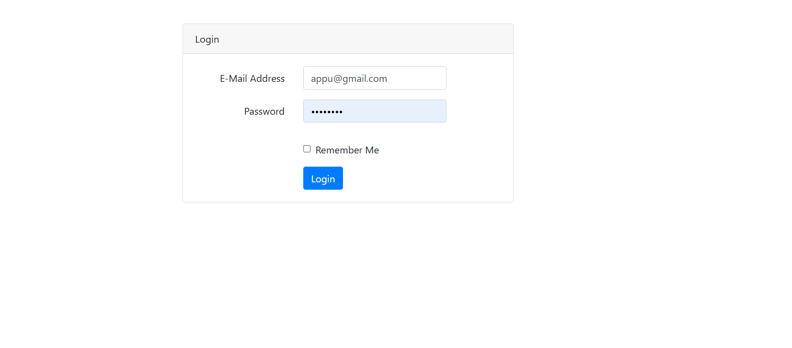
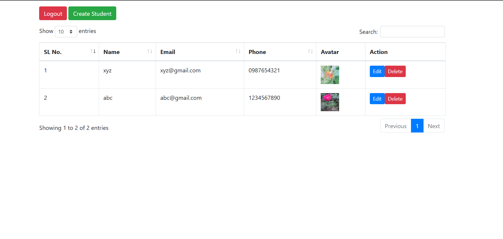
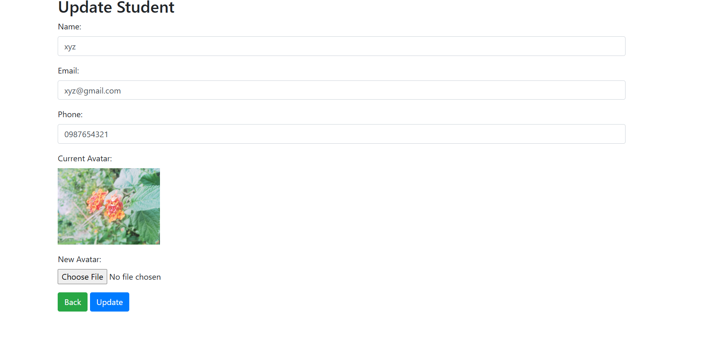

# Datatable AJAX CRUD Application

This project is a Laravel-based CRUD application that demonstrates secure authentication, server-side DataTable integration, image upload, and form validation. The application includes a user login system and a student management module.

---

## ✨ Features

- User authentication using **Laravel Sanctum (inbuilt)**
- Login system with seeded user credentials
- Student CRUD operations
  - Create
  - Read (DataTable with AJAX)
  - Update
  - Delete
- Server-side DataTable integration
- Image upload support
- Form validation
- Modal-based forms
- Secure access using middleware

---

## 🛠️ Tech Stack

- Laravel
- Laravel Sanctum
- MySQL
- Blade Templates
- jQuery
- AJAX
- DataTables
- Bootstrap / Tailwind CSS

---

## 🔐 Authentication

- Authentication is handled using **Laravel Sanctum**
- Only authenticated users can access the student module
- User credentials are generated using **database seeders**

---

